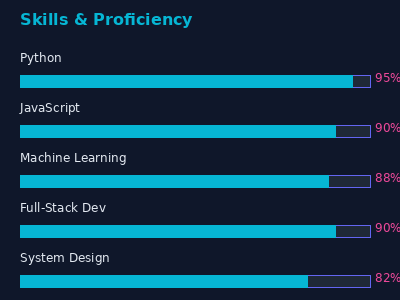

<div align="center">


</div>

<div align="center">




</div>

---

## 🚀 About Me

```
┌─────────────────────────────────────────────────────┐
│  Computer Science Engineer | Data Science Focus    │
│  Building AI/ML systems & scalable applications     │
│                                                     │
│  ✨ Currently crafting: PRAYAG, NLP Pipeline, RAG  │
│  🎯 Interest: AI, ML, Full-Stack, Cloud & Research │
│  🏆 Achievement: Top 6 HackQuest'25, Best Idea     │
└─────────────────────────────────────────────────────┘
```

---

## 🎯 Quick Stats

<div align="center">

[](https://github.com/krishnanunni6707)
[](https://github.com/krishnanunni6707)

</div>

<div align="center">

| 📊 | Metric | 
|:---|:-------|
| 🏗️ | **11+** Active Projects |
| 💻 | **8+** Languages |
| 🧠 | **AI/ML** Focus |
| 🌍 | **3+** Continents |

</div>

---

## 💻 Tech Stack Showcase

### 🔥 Primary Arsenal

<div align="center">


</div>

### 🧠 AI/ML Stack

<div align="center">


</div>

### ☁️ Cloud & DevOps

<div align="center">


</div>

---

## 🔥 Featured Projects

<div align="center">

### 🎧 Universal Audio Priority Ranker (UAPR)
**AI audio analysis with YAMNet + Whisper**
- Detects sounds & determines priority
- Real-time audio processing
- PyTorch-powered intelligence

[](https://github.com/krishnanunni6707/UAPR)

---

### 🏗️ PRAYAG - Event Management Backend
**Fastify + TypeScript + Supabase**
- JWT-based authentication
- QR-based check-in system
- Event coordinator management
- Supabase Storage integration

[](https://github.com/krishnanunni6707)

---

### 🏛️ gen-gov - Government Schemes RAG
**FastAPI + Next.js + ChromaDB + LLMs**
- Intelligent information retrieval
- Multi-turn conversations
- Civic document aesthetic
- Mobile-responsive design

[](https://github.com/krishnanunni6707)

---

### 📝 NLP Sentiment + Emotion Analysis
**Dual-path Hindi/English Pipeline**
- IndicBERT v2 for Hindi
- Emotion-aware summarization
- Structured JSON output
- CISCom 2025 Research

[](https://github.com/krishnanunni6707)

</div>

---

## 📊 GitHub Analytics

<div align="center">

[](https://github.com/krishnanunni6707)

[](https://github.com/krishnanunni6707)

[](https://github.com/krishnanunni6707)

</div>

---

## 🏆 Achievements & Milestones

<table align="center">
<tr>
<td align="center" width="50%">

### 🥇 2025
**HackQuest'25**
Top 6 National Hackathon

</td>
<td align="center" width="50%">

### 📄 2025  
**CISCom 2025**
Research Publication

</td>
</tr>
<tr>
<td align="center" width="50%">

### 🏆 2024
**Code for College**
Best Idea Award

</td>
<td align="center" width="50%">

### 🎤 2024
**Community Lead**
Technical Mentor

</td>
</tr>
</table>

---

## 🧠 What I'm Building

```python
current_focus = {
    "learning": [
        "Advanced Machine Learning",
        "Deep Learning & LLMs",
        "System Design",
        "Edge AI",
        "Cloud Architecture"
    ],
    
    "building": [
        "AI-powered applications",
        "Full-stack systems",
        "Intelligent IoT solutions",
        "Research prototypes"
    ],
    
    "philosophy": "Build technology that solves real-world problems"
}
```

---

## 🤝 Let's Connect & Collaborate

I'm interested in:

- 🤖 **AI/ML Projects** — Building intelligent systems
- 🚀 **Hackathons** — Rapid innovation & prototyping
- 💡 **Open Source** — Contributing to meaningful projects
- 🔬 **Research** — Exploring new frontiers
- 🌐 **Full-Stack** — End-to-end system design
- 🧠 **Technical Discussions** — Deep problem solving

<div align="center">

[](mailto:krishnanunni.official.dev@gmail.com)
[](https://www.linkedin.com/in/krishnanunni-h-pillai-b87448327)
[](https://github.com/krishnanunni6707)
[](https://krishnanunni6707.github.io)

</div>

---

## 💡 Philosophy

> **"Build. Break. Learn. Repeat."**

Every problem is an opportunity to:
- ✅ Learn something new
- ✅ Challenge assumptions
- ✅ Collaborate brilliantly
- ✅ Create real impact

---

<div align="center">

### 🌟 Have an interesting idea? Let's build it together! 🚀


---

*"Innovation happens at the intersection of curiosity and execution."*

</div>
